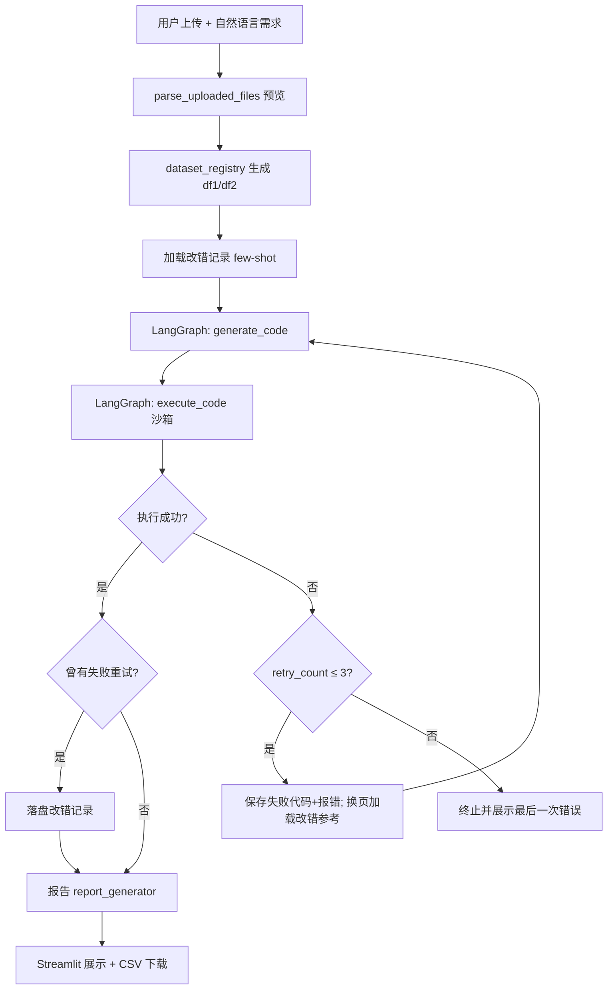

# 数据分析师 AI Agent

基于 **Python 3.11 + Streamlit + LangChain 0.3.x + Pandas** 的对话式数据分析助手。用户上传一张或多张表格（CSV / Excel），用自然语言描述分析需求后，系统自动生成 Pandas 代码，在**安全沙箱**中执行，完成清洗、关联与异常处理，并返回**独立可视化**、**可下载 CSV 结果**与 **Markdown 数据报告**。

## 功能概览

| 能力 | 说明 |
|------|------|
| 文件上传与解析 | 支持 CSV、`.xls`（xlrd 1.2.0）、`.xlsx`（openpyxl）；CSV 自动尝试 utf-8 / gbk / gb2312 |
| **多文件 / 多表分析** | 一次最多上传 **10** 个文件（可配置）；按顺序命名为 `df1`、`df2`…，支持 `pd.merge` / `pd.concat` 等关联分析 |
| **独立可视化** | 上传后或分析完成后均可选 X/Y 坐标即时出图，与 LLM 分析流程无关 |
| 智能代码生成 | 内置常见数据处理语义对照、代码模板与 Debug 指引；失败时将错误代码与报错反馈给 LLM |
| **改错记录自我迭代** | 失败后修正成功时自动落盘；启动加载并在生成时注入 few-shot；重试轮次递增换页加载参考 |
| 回溯重试 | LangGraph 编排「生成 → 执行」；沙箱失败最多回溯重试 **3 次**（共最多 4 轮） |
| 沙箱执行 | RestrictedPython + 子进程隔离 + 超时控制；支持多表注入与 pandas 列赋值 |
| 分析报告 | LLM 生成结构化 Markdown；失败时可降级为模板报告 |
| 结果导出 | 沙箱执行成功后，可下载处理结果为 CSV |

## 技术栈

- **运行时**：Python 3.11
- **前端**：Streamlit
- **Agent**：LangChain 0.3.x + **LangGraph**（代码生成 / 执行回溯）
- **数据**：Pandas、NumPy
- **安全执行**：RestrictedPython 7.0
- **依赖版本**：见根目录 `requirements.txt`

## 项目结构

```
data_analyst_agent/
├── main.py                  # Streamlit 入口（多文件上传、独立绘图、分析流水线）
├── .env                     # API 与运行参数（勿提交）
├── requirements.txt
├── config/settings.py       # 上传限制、沙箱、改错记录、日志等配置
├── utils/                   # 文件解析、路径、日志
├── agent/
│   ├── code_generator.py    # 提示词、模板、改错 few-shot 注入
│   ├── analysis_graph.py    # 生成 ↔ 执行 回溯重试
│   ├── correction_store.py  # 改错记录落盘 / 加载 / 分页检索
│   ├── dataset_registry.py  # 多表 DatasetInfo 与 df1/df2 变量名
│   └── report_generator.py
├── sandbox/                 # 安全执行（多表 datasets 注入）
├── visualization/           # 图表构建与保存
└── temp_files/              # 上传、图表、报告、改错记录、日志（运行时生成）
```

## 快速开始

### 1. 环境准备

```bash
cd data_analyst_agent
conda create -n data_analyst_agent python=3.11 -y
conda activate data_analyst_agent

pip install -r requirements.txt
```

### 2. 配置环境变量

编辑根目录 `.env`（必填项不能为空）：

```env
OPENAI_API_KEY=your_key
OPENAI_API_BASE=https://your-endpoint/v1
OPENAI_MODEL=gpt-4o-mini
SANDBOX_TIMEOUT_SEC=30
MAX_UPLOAD_MB=20
MAX_UPLOAD_FILES=10
MAX_TOTAL_UPLOAD_MB=50
LOG_LEVEL=INFO
```

可选（改错记录 few-shot 自我迭代）：

```env
CORRECTION_ENABLED=true
CORRECTION_MAX_RECORDS=200
CORRECTION_TOP_K=2
```

智谱等 OpenAI 兼容接口示例：

```env
OPENAI_API_BASE=https://open.bigmodel.cn/api/paas/v4
OPENAI_MODEL=glm-4-flash
```

### 3. 启动 Web 应用

```bash
conda activate data_analyst_agent
cd data_analyst_agent
streamlit run main.py
```

浏览器默认打开 `http://localhost:8501`。侧边栏会显示「已加载改错记录：N 条」。

### 4. 使用流程

1. **上传数据**：侧边栏或主区域上传 CSV / XLS / XLSX（**可多选**）。
   - 单文件不超过 `MAX_UPLOAD_MB`（默认 20 MB）
   - 最多 `MAX_UPLOAD_FILES` 个文件（默认 10）
   - 总大小不超过 `MAX_TOTAL_UPLOAD_MB`（默认 50 MB）
2. **查看预览**：展开「数据预览」；多表时按 `df1`、`df2` 分 Tab 展示。
3. **即时绘图**（可选）：在「数据可视化」区选择图表类型与 X/Y 列，**无需点击开始分析**即可出图。
4. **填写需求**：在文本框用中文描述清洗或分析目标。
   - 单表示例：「删除 amount 为空的行，按 category 汇总 value」
   - 多表示例：「将 df1 与 df2 按 order_id 关联，汇总各品类金额」
5. **可选设置**（侧边栏）：是否生成 Markdown 报告、LLM 失败时是否用模板降级
6. 点击 **「开始分析」**，等待 LangGraph 工作流：生成代码 → 沙箱执行（失败则带错误回溯重试，最多 3 次）→ 报告。
7. **查看结果**：最终代码、回溯重试历史（如有）、执行结果、Markdown 报告；成功时可 **下载 CSV**，并在结果区 **独立选坐标出图**。

### 5. 多表沙箱变量约定

| 场景 | 沙箱内可用变量 |
|------|----------------|
| 单文件 | `df1`（`df` 为别名） |
| 多文件 | `df1`、`df2`、… 按上传顺序；`df` 仍指向 **df1** |
| 分析结论 | 必须赋值 `result`（DataFrame / Series / dict / list / 标量） |

变量名由 `agent/dataset_registry.py` 按上传顺序自动生成（`df1`、`df2`…）。

### 6. 产出文件位置

| 类型 | 目录 |
|------|------|
| 上传文件 | `temp_files/uploads/` |
| 图表 PNG | `temp_files/charts/` |
| 分析报告 | `temp_files/outputs/` |
| **改错记录** | `temp_files/correction_records/corrections.jsonl` |
| 运行日志 | `temp_files/logs/` |

---

## 核心工作流（LangGraph）



**状态字段（`AnalysisState`）**：`datasets`、`previous_code`、`previous_error`、`previous_error_type`、`retry_history`、`retry_count`。

重试时 `code_generator` 将上一轮失败代码与异常送入 LLM，并按 `retry_count` 分页加载下一批改错参考（第 1 次用 Top-K，第 2 次用接下来 Top-K，无更多则不注入）。

---

## 改错记录（自我迭代）

| 环节 | 行为 |
|------|------|
| **落盘** | 沙箱至少失败 1 次且最终成功 → 写入「需求 + 错误代码 + 正确代码 + 报错」 |
| **启动** | 读取 `corrections.jsonl` 到内存，侧边栏显示条数 |
| **生成前** | 按 schema 指纹 / 报错类型 / 需求相似度排序，注入 few-shot |
| **分页** | `retry_count=0` 取第 1～K 条；`=1` 取第 K+1～2K 条；依此类推 |
| **去重** | 相同需求+错误+正确+schema 不重复写入；最多保留 `CORRECTION_MAX_RECORDS` 条 |

这不是模型微调，而是 **Prompt 经验回放**，适合本地 Agent 轻量迭代。

---

## 调试与单模块测试

在项目根目录执行，需已配置 `.env`（调用 LLM 的模块）。

| 模块 | 命令 | 说明 |
|------|------|------|
| 配置 | `python -c "from config import settings; print(settings.OPENAI_MODEL)"` | 检查环境变量加载 |
| 路径 | `python -m utils.path_helper` | 路径与安全校验 |
| 日志 | `python -m utils.logger` | 控制台 + 文件日志 |
| 解析 | `python -m utils.file_parser` | CSV 读写与批量预览 |
| 沙箱 | `python -m sandbox.code_sandbox` | 安全审计 + pandas 赋值用例 |
| 图表 | `python -m visualization.chart_builder` | 三种图 + 保存 |
| 图表保存 | `python -m visualization.chart_save` | PNG / HTML |
| 代码生成 | `python -m agent.code_generator` | 离线校验；`--live` 调 API |
| **LangGraph** | `python -m agent.analysis_graph` | 验证工作流图可编译 |
| **改错记录** | `python -m agent.correction_store` | 加载与分页检索自检 |
| 报告 | `python -m agent.report_generator` | 模板报告；`--live` 调 API |
| **应用** | `streamlit run main.py` | 完整端到端流程 |

### 常见问题

- **启动报错 `Missing required environment variable`**：检查 `.env` 中 `OPENAI_API_KEY`、`OPENAI_API_BASE` 非空。
- **`pip install` 依赖冲突**：使用 readme 锁定版 `requirements.txt`，建议新建 conda 环境。
- **中文图表乱码**：Windows 需安装「微软雅黑」或 SimHei；代码已做字体回退。
- **多表关联失败**：确认需求中的列名与各表 preview 一致；沙箱变量名为 `df1`、`df2`…
- **`object does not support item or slice assignment`**：pandas 列赋值已在沙箱 write guard 中放行；请重启 Streamlit 加载最新代码。
- **沙箱执行失败**：页面会展示回溯重试记录；仍失败请检查列名与 `result` 赋值；最多自动重试 3 次。
- **改错记录不增长**：仅「失败后最终成功」才落盘；首轮一次成功不会产生记录。
- **Streamlit 端口占用**：`streamlit run main.py --server.port 8502`

### 开发顺序（已完成）

1. `config/settings.py`
2. `utils/path_helper.py` → `logger.py` → `file_parser.py`
3. `sandbox/safe_globals.py` → `code_sandbox.py`
4. `visualization/chart_builder.py` → `chart_save.py`
5. `agent/code_generator.py` → `analysis_graph.py` → `report_generator.py`
6. `agent/dataset_registry.py`（多表注册与 df1/df2 变量名）
7. `agent/correction_store.py`（改错记录落盘与 few-shot 分页）
8. `main.py`（多文件上传、独立绘图、CSV 导出）

---

## 安全与规范摘要

- AI 生成代码**仅做数据处理**；禁止 `os`、`subprocess`、`socket` 等。
- 沙箱：**RestrictedPython** + **子进程** + **超时终止**；多表通过 pickle 传入子进程后注入命名空间。
- pandas/numpy 对象允许列赋值与 `loc`/`iloc` 写入（自定义 write guard）。
- 路径使用 `pathlib.Path`；IO 与执行逻辑带 `try-except`。
- LangChain 使用 **0.3.x** 分包导入。

## 模块导入示例

```python
from utils.file_parser import parse_uploaded_files
from agent.dataset_registry import datasets_to_dict, merge_previews_for_legacy
from agent.analysis_graph import run_analysis_graph
from agent.correction_store import ensure_correction_records_loaded
from agent.report_generator import generate_markdown_report
```

## 许可证

待定。
