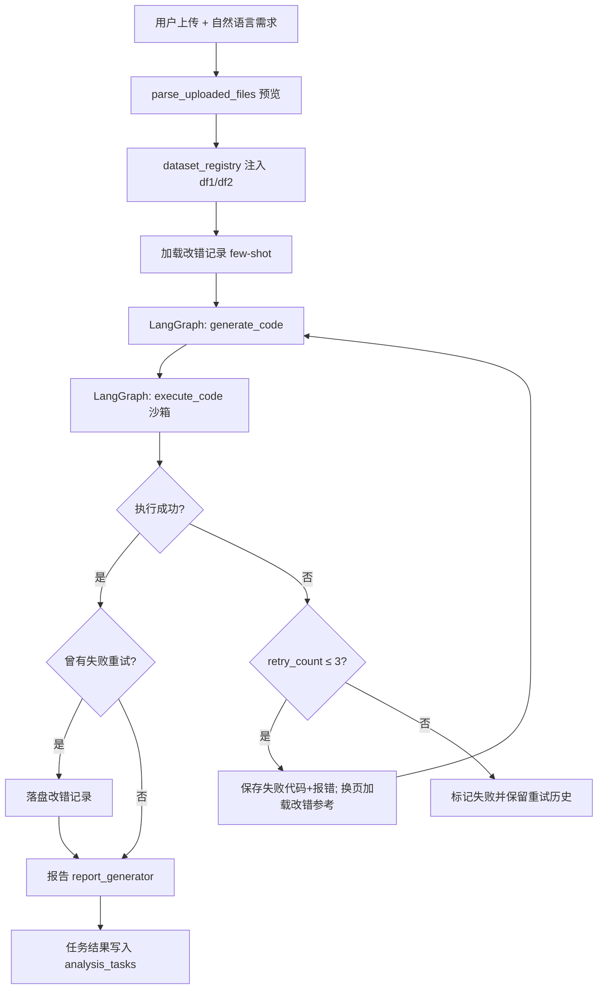
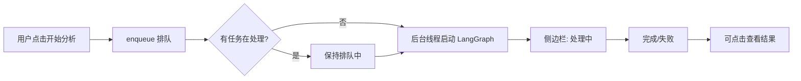

# 数据分析师 AI Agent

基于 **Python 3.11 + Streamlit + LangChain 0.3.x + Pandas** 的对话式数据分析助手。用户上传一张或多张表格（CSV / Excel），用自然语言描述分析需求后，系统自动生成 Pandas 代码，在**安全沙箱**中执行，完成清洗、关联与异常处理，并返回**手动触发的可视化**、**可下载 CSV 结果**与 **Markdown 数据报告**。

## 功能概览

| 能力 | 说明 |
|------|------|
| 文件上传与解析 | 支持 CSV、`.xls`（xlrd 1.2.0）、`.xlsx`（openpyxl）；CSV 自动尝试 utf-8 / gbk / gb2312 |
| **多文件 / 多表分析** | 一次最多上传 **10** 个文件（可配置）；沙箱内按顺序注入 `df1`、`df2`…；界面以**文件名**展示，用户自然语言可直接写文件名 |
| **侧边栏任务队列** | 点击「开始分析」后任务进入左侧列表，显示 **排队中 / 处理中 / 已完成 / 失败**；支持取消、关闭（确认弹窗）、点击查看历史结果 |
| **非阻塞分析** | 分析在后台线程执行；处理中仍可修改需求并继续排队、在「数据可视化」区手动出图 |
| **独立可视化** | 上传后或分析完成后均可选 X/Y 坐标，点击「生成图表」才出图；PNG 可下载，浏览器可右键复制 |
| **多表输出** | `result` 可为 dict（语义化键名）或多张 DataFrame；每张表独立 Tab 展示与 CSV 下载，受 `MAX_OUTPUT_TABLES` 限制 |
| 智能代码生成 | 内置常见数据处理语义对照、代码模板与 Debug 指引；失败时将错误代码与报错反馈给 LLM |
| **改错记录自我迭代** | 失败后修正成功时自动落盘；启动加载并在生成时注入 few-shot；重试轮次递增换页加载参考 |
| 回溯重试 | LangGraph 编排「生成 → 执行」；沙箱失败最多回溯重试 **3 次**（共最多 4 轮） |
| 沙箱执行 | RestrictedPython + 子进程隔离 + 超时控制；支持多表注入与 pandas 列赋值 |
| 分析报告 | LLM 生成结构化 Markdown；失败时可降级为模板报告 |

## 技术栈

- **运行时**：Python 3.11
- **前端**：Streamlit 1.36
- **Agent**：LangChain 0.3.x + **LangGraph**（代码生成 / 执行回溯）
- **数据**：Pandas、NumPy
- **安全执行**：RestrictedPython 7.0
- **依赖版本**：见根目录 `requirements.txt`

## 项目结构

```
data_analyst_agent/
├── main.py                  # Streamlit 入口（任务队列、独立绘图、结果展示）
├── .env                     # API 与运行参数（勿提交）
├── requirements.txt
├── config/settings.py       # 上传限制、沙箱、改错记录、输出表上限等
├── utils/
│   ├── file_parser.py       # CSV / Excel 解析
│   ├── result_tables.py     # 沙箱 result 多表解析与 CSV 导出
│   └── ...
├── agent/
│   ├── code_generator.py    # 提示词、模板、文件名→sandbox_key 映射
│   ├── analysis_graph.py    # 生成 ↔ 执行 回溯重试
│   ├── analysis_tasks.py    # 分析任务排队、后台执行、结果快照
│   ├── correction_store.py  # 改错记录落盘 / 加载 / 分页检索
│   ├── dataset_registry.py  # 多表 DatasetInfo（界面 filename / 沙箱 df1/df2）
│   └── report_generator.py
├── sandbox/                 # 安全执行（多表 datasets 注入）
├── visualization/           # 图表构建与保存
└── temp_files/              # 上传、图表、报告、改错记录、日志（运行时生成）
```

## 快速开始

### 1. 环境准备

```bash
cd data_analyst_agent
conda create -n data_analyst_agent python=3.11 -y
conda activate data_analyst_agent

pip install -r requirements.txt
```

### 2. 配置环境变量

编辑根目录 `.env`（必填项不能为空）：

```env
OPENAI_API_KEY=your_key
OPENAI_API_BASE=https://your-endpoint/v1
OPENAI_MODEL=gpt-4o-mini
SANDBOX_TIMEOUT_SEC=30
MAX_UPLOAD_MB=20
MAX_UPLOAD_FILES=10
MAX_TOTAL_UPLOAD_MB=50
LOG_LEVEL=INFO
```

可选：

```env
# 改错记录 few-shot 自我迭代
CORRECTION_ENABLED=true
CORRECTION_MAX_RECORDS=200
CORRECTION_TOP_K=2

# 沙箱 result 最多展示/导出几张表（默认 5）
MAX_OUTPUT_TABLES=5
```

智谱等 OpenAI 兼容接口示例：

```env
OPENAI_API_BASE=https://open.bigmodel.cn/api/paas/v4
OPENAI_MODEL=glm-4-flash
```

### 3. 启动 Web 应用

```bash
conda activate data_analyst_agent
cd data_analyst_agent
streamlit run main.py
```

浏览器默认打开 `http://localhost:8501`。侧边栏会显示「已加载改错记录：N 条」与「分析任务」列表。

### 4. 使用流程

1. **上传数据**：主区域上传 CSV / XLS / XLSX（**可多选**）。
   - 单文件不超过 `MAX_UPLOAD_MB`（默认 20 MB）
   - 最多 `MAX_UPLOAD_FILES` 个文件（默认 10）
   - 总大小不超过 `MAX_TOTAL_UPLOAD_MB`（默认 50 MB）
2. **查看预览**：展开「数据预览」；多表时按**文件名**分 Tab 展示（界面不显示 `df1`/`df2`）。
3. **即时绘图**（可选）：在「数据可视化」区选择图表类型与 X/Y 列，点击 **「生成图表」** 才出图；可随时 **「清除图表」** 重选坐标；与分析互不阻塞。
4. **填写需求**：在文本框用中文描述清洗或分析目标，**可直接写文件名**。
   - 单表示例：「删除 amount 为空的行，按 category 汇总 value」
   - 多表示例：「将 sales.csv 与 orders.xlsx 按 order_id 关联，输出品类汇总和清洗明细两张表」
5. **可选设置**（侧边栏）：是否生成 Markdown 报告、LLM 失败时是否用模板降级
6. 点击 **「开始分析」**：
   - 任务进入侧边栏 **分析任务** 列表（排队中 → 处理中 → 已完成/失败）
   - 主界面显示当前正在处理的需求摘要
   - **处理中可继续修改输入并再次点击**，新任务自动排队
   - 后台执行 LangGraph：生成代码 → 沙箱执行（失败则回溯重试，最多 3 次）→ 报告
7. **查看结果**：
   - 侧边栏点击 **已完成 / 失败** 任务，主区域展示该任务的代码、回溯重试历史、执行结果、报告
   - 成功时可按 Tab 下载各输出表 CSV，并在结果区 **手动生成图表**（PNG 下载 / 右键复制）
   - **排队中 / 处理中** 任务不可点击查看详情；可点 **取消**；已完成任务可 **关闭**（弹出确认窗口）

### 5. 界面与沙箱变量约定

| 层级 | 约定 |
|------|------|
| **用户界面** | 以上传 **文件名** 指代表（Tab、提示文案、绘图选文件） |
| **自然语言** | 用户可说文件名；LLM 根据 preview 中的 `filename` + `sandbox_key` 映射写代码 |
| **沙箱单文件** | `df1`（`df` 为别名） |
| **沙箱多文件** | `df1`、`df2`、… 按上传顺序；`df` 仍指向 **df1** |
| **分析结论** | 必须赋值 `result`；推荐 dict 多表输出，键名为用户可读表名 |

```python
# 多表输出示例（LLM 生成）
result = {
    "品类汇总": summary_df,
    "清洗明细": detail_df,
}
```

### 6. 产出文件位置

| 类型 | 目录 |
|------|------|
| 上传文件 | `temp_files/uploads/` |
| 图表 PNG | `temp_files/charts/` |
| 分析报告 | `temp_files/outputs/` |
| **改错记录** | `temp_files/correction_records/corrections.jsonl` |
| 运行日志 | `temp_files/logs/` |

---

## 核心工作流

### LangGraph（单任务内）



### 任务队列（Streamlit 层）



- 同一时刻仅 **1** 个分析任务在后台执行，其余 **排队**。
- 任务结果（代码、沙箱输出、报告、重试历史）保存在 `st.session_state.analysis_tasks`，与主界面输入框解耦。

---

## 改错记录（自我迭代）

| 环节 | 行为 |
|------|------|
| **落盘** | 沙箱至少失败 1 次且最终成功 → 写入「需求 + 错误代码 + 正确代码 + 报错」 |
| **启动** | 读取 `corrections.jsonl` 到内存，侧边栏显示条数 |
| **生成前** | 按 schema 指纹 / 报错类型 / 需求相似度排序，注入 few-shot |
| **分页** | `retry_count=0` 取第 1～K 条；`=1` 取第 K+1～2K 条；依此类推 |
| **去重** | 相同需求+错误+正确+schema 不重复写入；最多保留 `CORRECTION_MAX_RECORDS` 条 |

Prompt 经验回放，适合本地 Agent 轻量迭代。

---

## 调试与单模块测试

在项目根目录执行，需已配置 `.env`（调用 LLM 的模块）。

| 模块 | 命令 | 说明 |
|------|------|------|
| 配置 | `python -c "from config import settings; print(settings.OPENAI_MODEL)"` | 检查环境变量加载 |
| 路径 | `python -m utils.path_helper` | 路径与安全校验 |
| 日志 | `python -m utils.logger` | 控制台 + 文件日志 |
| 解析 | `python -m utils.file_parser` | CSV 读写与批量预览 |
| **多表结果** | `python -m utils.result_tables` | result dict/DataFrame 解析自检 |
| 沙箱 | `python -m sandbox.code_sandbox` | 安全审计 + pandas 赋值用例 |
| 图表 | `python -m visualization.chart_builder` | 三种图 + 保存 |
| 代码生成 | `python -m agent.code_generator` | 离线校验；`--live` 调 API |
| **LangGraph** | `python -m agent.analysis_graph` | 验证工作流图可编译 |
| **改错记录** | `python -m agent.correction_store` | 加载与分页检索自检 |
| 报告 | `python -m agent.report_generator` | 模板报告；`--live` 调 API |
| **应用** | `streamlit run main.py` | 完整端到端流程 |

### 常见问题

- **启动报错 `Missing required environment variable`**：检查 `.env` 中 `OPENAI_API_KEY`、`OPENAI_API_BASE` 非空。
- **`pip install` 依赖冲突**：使用 readme 锁定版 `requirements.txt`，建议新建 conda 环境。
- **中文图表乱码**：Windows 需安装「微软雅黑」或 SimHei；代码已做字体回退。
- **OpenMP 重复初始化警告**：启动时已设置 `KMP_DUPLICATE_LIB_OK=TRUE` 兼容项。
- **多表关联失败**：确认需求中的列名与各表 preview 一致；界面用文件名描述，沙箱内仍为 `df1`/`df2`…
- **`object does not support item or slice assignment`**：pandas 列赋值已在沙箱 write guard 中放行；请重启 Streamlit 加载最新代码。
- **沙箱执行失败**：点击侧边栏失败任务查看回溯重试记录；最多自动重试 3 次。
- **输出表被截断**：调整 `.env` 中 `MAX_OUTPUT_TABLES`（默认 5）。
- **改错记录不增长**：仅「失败后最终成功」才落盘；首轮一次成功不会产生记录。
- **Streamlit 端口占用**：`streamlit run main.py --server.port 8502`
- **`use_container_width` 报错**：Streamlit 1.36 下图表展示已做 `use_column_width` 回退。

### 开发顺序（已完成）

1. `config/settings.py`
2. `utils/path_helper.py` → `logger.py` → `file_parser.py` → `result_tables.py`
3. `sandbox/safe_globals.py` → `code_sandbox.py`
4. `visualization/chart_builder.py` → `chart_save.py`
5. `agent/code_generator.py` → `analysis_graph.py` → `report_generator.py`
6. `agent/dataset_registry.py`（多表注册；界面 filename / 沙箱 df1/df2）
7. `agent/correction_store.py`（改错记录落盘与 few-shot 分页）
8. `agent/analysis_tasks.py`（任务队列与后台执行）
9. `main.py`（任务侧边栏、非阻塞分析、手动绘图、多表 CSV 导出）

---

## 安全与规范摘要

- AI 生成代码**仅做数据处理**；禁止 `os`、`subprocess`、`socket` 等。
- 沙箱：**RestrictedPython** + **子进程** + **超时终止**；多表通过 pickle 传入子进程后注入命名空间。
- pandas/numpy 对象允许列赋值与 `loc`/`iloc` 写入（自定义 write guard）。
- 路径使用 `pathlib.Path`；IO 与执行逻辑带 `try-except`。
- LangChain 使用 **0.3.x** 分包导入。

## 模块导入示例

```python
from utils.file_parser import parse_uploaded_files
from utils.result_tables import extract_result_tables
from agent.dataset_registry import datasets_to_dict, merge_previews_for_legacy
from agent.analysis_graph import run_analysis_graph
from agent.analysis_tasks import enqueue_analysis_task, advance_task_queue
from agent.correction_store import ensure_correction_records_loaded
from agent.report_generator import generate_markdown_report
```

## 许可证

待定。
