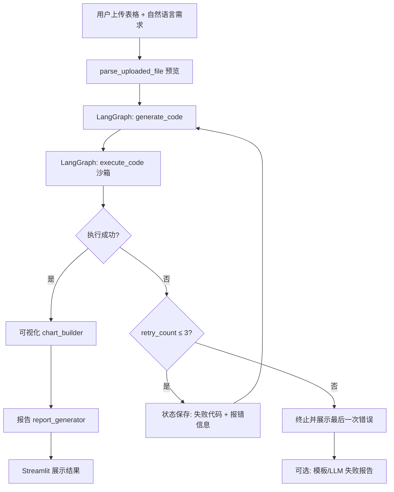

# 数据分析师 AI Agent

基于 **Python 3.11 + Streamlit + LangChain 0.3.x + Pandas** 的对话式数据分析助手。用户上传表格（CSV / Excel）并用自然语言描述分析需求后，系统自动生成 Pandas 代码，在**安全沙箱**中执行，完成清洗与异常处理，并返回**可视化图表**与 **Markdown 数据报告**。

## 功能概览

| 能力 | 说明 |
|------|------|
| 文件上传与解析 | 支持 CSV、`.xls`（xlrd 1.2.0）、`.xlsx`（openpyxl）；CSV 自动尝试 utf-8 / gbk / gb2312 |
| 智能代码生成 | LangChain 生成 Pandas 代码；失败时将错误代码与报错反馈给 LLM |
| 回溯重试 | LangGraph 编排「生成 → 执行」；沙箱失败最多回溯重试 **3 次**（共最多 4 轮） |
| 沙箱执行 | RestrictedPython + 子进程隔离 + 超时控制，禁止高危模块与系统操作 |
| 可视化 | Matplotlib / Seaborn，折线 / 柱状 / 箱线图，Windows 中文字体回退 |
| 分析报告 | LLM 生成结构化 Markdown；失败时可降级为模板报告 |

## 技术栈

- **运行时**：Python 3.11
- **前端**：Streamlit
- **Agent**：LangChain 0.3.x + **LangGraph**（代码生成 / 执行回溯）
- **数据**：Pandas、NumPy
- **安全执行**：RestrictedPython 7.0
- **依赖版本**：见根目录 `requirements.txt`

## 项目结构

```
data_analyst_agent/
├── main.py                  # Streamlit 入口
├── .env                     # API 与运行参数（勿提交）
├── requirements.txt
├── config/settings.py
├── utils/                   # 文件解析、路径、日志
├── agent/                   # 代码生成、LangGraph 工作流、报告生成
│   ├── code_generator.py
│   ├── analysis_graph.py    # 生成 ↔ 执行 回溯重试
│   └── report_generator.py
├── sandbox/                 # 安全执行
├── visualization/           # 图表构建与保存
└── temp_files/              # 上传、图表、报告、日志（运行时生成）
```

## 快速开始

### 1. 环境准备

```bash
cd data_analyst_agent
conda create -n data_analyst_agent python=3.11 -y
conda activate data_analyst_agent

pip install -r requirements.txt
```

### 2. 配置环境变量

编辑根目录 `.env`（必填项不能为空）：

```env
OPENAI_API_KEY=your_key
OPENAI_API_BASE=https://your-endpoint/v1
OPENAI_MODEL=gpt-4o-mini
SANDBOX_TIMEOUT_SEC=30
MAX_UPLOAD_MB=20
LOG_LEVEL=INFO
```

智谱等 OpenAI 兼容接口示例：

```env
OPENAI_API_BASE=https://open.bigmodel.cn/api/paas/v4
OPENAI_MODEL=glm-4-flash
```

### 3. 启动 Web 应用

```bash
conda activate data_analyst_agent
cd data_analyst_agent
streamlit run main.py
```

浏览器默认打开 `http://localhost:8501`。

### 4. 使用流程

1. **上传数据**：侧边栏或主区域上传 CSV / XLS / XLSX（不超过 `MAX_UPLOAD_MB`）。
2. **查看预览**：展开「数据预览」确认列名、类型与样例行。
3. **填写需求**：在文本框用中文描述清洗或分析目标（如「删除空值并求和」）。
4. **可选设置**（侧边栏）：
   - 是否生成图表、图表类型（折线 / 柱状 / 箱线）
   - 是否生成 Markdown 报告、LLM 失败时是否用模板降级
5. **选择 X/Y 列**：用于绘图（至少 2 列数据时可用）。
6. 点击 **「开始分析」**，等待 LangGraph 工作流：生成代码 → 沙箱执行（失败则带错误回溯重试，最多 3 次）→ 图表 → 报告。
7. **查看结果**：最终代码、回溯重试历史（如有）、执行结果、图表、Markdown 报告。

### 5. 产出文件位置

| 类型 | 目录 |
|------|------|
| 上传文件 | `temp_files/uploads/` |
| 图表 PNG | `temp_files/charts/` |
| 分析报告 | `temp_files/outputs/` |
| 运行日志 | `temp_files/logs/` |

---

## 核心工作流（LangGraph）



**状态字段（`AnalysisState`）**：`previous_code`、`previous_error`、`previous_error_type`、`retry_history`、`retry_count`。

重试时 `code_generator` 将上一轮失败代码与异常一并送入 LLM，请求修正后重新校验并执行。

---

## 调试与单模块测试

在项目根目录执行，需已配置 `.env`（调用 LLM 的模块）。

| 模块 | 命令 | 说明 |
|------|------|------|
| 配置 | `python -c "from config import settings; print(settings.OPENAI_MODEL)"` | 检查环境变量加载 |
| 路径 | `python -m utils.path_helper` | 路径与安全校验 |
| 日志 | `python -m utils.logger` | 控制台 + 文件日志 |
| 解析 | `python -m utils.file_parser` | CSV 读写与预览 |
| 沙箱 | `python -m sandbox.code_sandbox` | 安全审计 12 项 |
| 图表 | `python -m visualization.chart_builder` | 三种图 + 保存 |
| 图表保存 | `python -m visualization.chart_save` | PNG / HTML |
| 代码生成 | `python -m agent.code_generator` | 离线校验；`--live` 调 API |
| **LangGraph** | `python -m agent.analysis_graph` | 验证工作流图可编译 |
| 报告 | `python -m agent.report_generator` | 模板报告；`--live` 调 API |
| **应用** | `streamlit run main.py` | 完整端到端流程 |

### 常见问题

- **启动报错 `Missing required environment variable`**：检查 `.env` 中 `OPENAI_API_KEY`、`OPENAI_API_BASE` 非空。
- **`pip install` 依赖冲突**：使用 readme 锁定版 `requirements.txt`，建议新建 conda 环境。
- **中文图表乱码**：Windows 需安装「微软雅黑」或 SimHei；代码已做字体回退。
- **沙箱执行失败**：页面会展示回溯重试记录；仍失败请检查列名与 `result` 赋值；最多自动重试 3 次。
- **Streamlit 端口占用**：`streamlit run main.py --server.port 8502`

### 开发顺序（已完成）

1. `config/settings.py`
2. `utils/path_helper.py` → `logger.py` → `file_parser.py`
3. `sandbox/safe_globals.py` → `code_sandbox.py`
4. `visualization/chart_builder.py` → `chart_save.py`
5. `agent/code_generator.py` → `analysis_graph.py` → `report_generator.py`
6. `main.py`

---

## 安全与规范摘要

- AI 生成代码**仅做数据处理**；禁止 `os`、`subprocess`、`socket` 等。
- 沙箱：**RestrictedPython** + **子进程** + **超时终止**。
- 路径使用 `pathlib.Path`；IO 与执行逻辑带 `try-except`。
- LangChain 使用 **0.3.x** 分包导入。


## 模块导入示例

```python
from utils.file_parser import parse_uploaded_file
from agent.analysis_graph import run_analysis_graph
from agent.report_generator import generate_markdown_report
```

## 许可证

待定。
